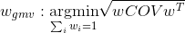
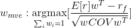
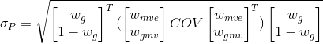
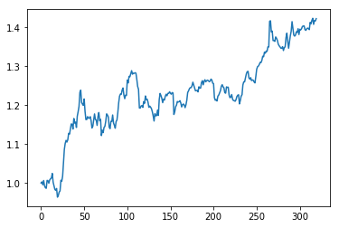
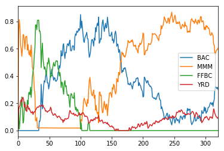

##TODO
<!--
# GMTA
trading algorithm to allocate assets dynamically on the efficient frontier.

### About this project
1. this package can be used as a simulator to see the algorithm performance with your own data
2. this package can be used to do intraday algorithmic trading together with [robinhood portfolio framework](https://github.com/zhhrozhh/Robinhood_Portfolio)
3. this package can be used to do daily algorithmic trading with both [robinhood portfolio framework](https://github.com/zhhrozhh/Robinhood_Portfolio) and [quandl EOD api](https://www.quandl.com/)
4. there is no guarantee of the algorithm performance, prepare to loss if you are using it for 2. or 3.

### Data format
data should be provide to this algorithm as [pandas.DataFrame](https://pandas.pydata.org/) where indexes are datetime and columns are names of assets.

data in each row are price change of each assets in that day.

data should contain at least 3 different assets, otherwise, you can just calculate everything by hand.

### Data example
|               | YRD       | MMM      | RH        |
| ------------- |:---------:|:--------:|:---------:|
| 2015-12-21    | 0.023077  | 0.003812 | -0.007858 |
| 2015-12-22    | 0.031149  | 0.010103 | -0.004777 |

### How it works
for given historical data, algorithm will pick the last n entries it to calculate:

 and 

where COV is the covariance matrix of assets and rf is the risk free rate. in this algorithm, since there is no option to buy risk free assets in robinhood, set rf to a higher value only results in a risky MVE portfolio.

all convex combinations of GMV and MVE are guarantee to be a portfolio on the efficient frontier, the trading algorithm simply change weights of your assets to be a specific combination of GMV and MVE. as new data comes in, both GMV and MVE will changed, and that will make the algorithm to make a new decision on what to sell/buy.

to further describe the result combination of assets, this algorithm can also calculate the risk(or variance) of output.



### Example code

simulating example:

```
from GMTA import GMTA
import matplotlib.pyplot as plt
import numpy as np

gmta = GMTA(["BAC","MMM","FFBC","YRD"],period = 200,quandl_apikey="my api key")
data = gtma.quandl_test_data_generator()
rts,chs = gmta.trading_simulator(data,0.02) # rts: return of each day, chs: weights of each assets over time
rts = np.array(rts)+1
for i in range(1,len(rts)):
    rts[i] = rts[i]*rts[i-1]
plt.plot(rts)
```


```
pd.DataFrame(chs,columns = ["BAC","MMM","FFBC","YRD"]).plot()
```


trading example:

```
from Portfolio import PortfolioMgr
gmta = GMTA(["YRD","MMM","RH","PCRX"])
pm = PortfolioMgr(robin_un = 'robin un',robin_pd = 'robin pd',name = 'demo')
pm.add_portfolio(name = "First",ini_bp = 500)
gmta.intraday_trading_with_robinhood(pm,"First")

```

### How to install
- install quandl(optional)
    ```
    pip3 install quandl
    ```
- install Robinhood Portfolio(oprional)
    ```
    git clone git@github.com:zhhrozhh/Robinhood.git
    cd Robinhood
    pip3 install .
    cd ..
    git clone git@github.com:zhhrozhh/Robinhood_Portfolio.git
    cd Robinhood_Portfolio
    pip3 install .
    ```
- install GMTA
    ```
    git@github.com:zhhrozhh/GMV-MVE-trading-algorithm.git
    cd GMV-MVE-trading-algorithm
    pip3 install .
    ```
    -->

